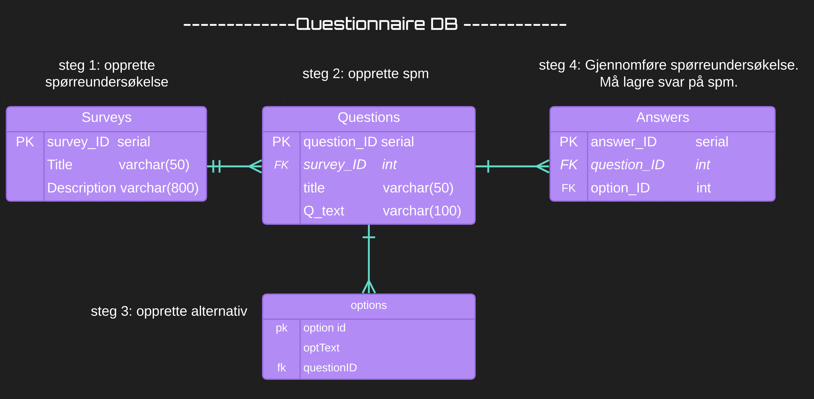
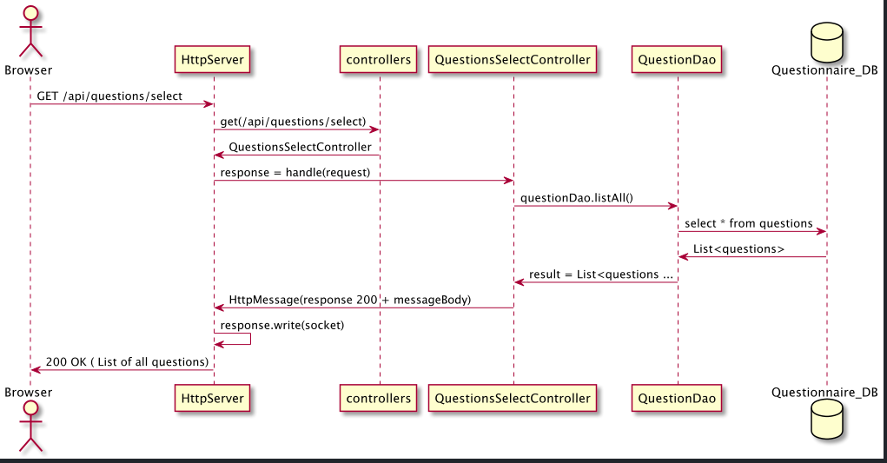

# PGR203 Avansert Java eksamen

## Bygge og kjøre prosjektet via Maven Package
* Kjør Java -jar /PGR203-Exam/target/pgr203-Exam-1.0-SNAPSHOT.jar i prosjektet sin rootfolder, for å starte serveren.
* Klikk på url-en som blir logget i konsoll.

## Programmets funksjonalitet
* Steg 1: Lag spørreundersøkelse
* Steg 2: Lage spørsmål til spørreundersøkelsen ( endre tittel / tekst, eventuelt slette spørsmålet)
* Steg 3: Legge til alternativer på spørsmålet
* Steg 4: Registrere svar på en eller flere spørreundersøkelser.
* Steg 5: Liste ut svar på en gitt hel spørreundersøkelse, eller svar på et enkelt spørsmål.

##Ekstra funksjonalitet:
* Oppdatere teksten / tittelen på et spørsmål
* Slette spørsmål fra databasen. Legg merke til: Ved sletting av spørsmål, slettes også tilhørende
verdier fra answers og options-tabellene.
* Inkorporert spørreundersøkelser i programmet.
* Feilhåndtering i backend, programmet kræsjer ikke ved forsøk på å gjøre spørringer mot f.eks tom database, eller ufullstendig input. Bruker altså ikke bare required i tag. Gjør kontrollspørringer mot databasen for å sjekke om det finnes data i databasen å jobbe mot. Svarer med 500-response hvis dette ikke er tilfelle, og har logikk for for å sette riktig feilmelding.
* En AbstractDao class som generaliserer de mest brukte metodene i Daoene.
* Går brukeren til "localhost:port/" blir du redirected til index.html. *
* Bruker 303 response med Location header på POST requests.
* Kontrollert coverage ved enhetstesting og ligger på over 84% på klasse- og metodedekning. Dette viser at vi tester
både daeoer og controllers.
* Vi har <!DOCTYPE html> i alle html-filene våre med fungerende css.
* Vi decoder nordiske karakterer som kommer fra klienten.
* Flere en 3 tabeller, avanserte spørringer.

## UML-diagram av databasen.

##Plant UML diagram av flyten i programmet.

## Erfaringer med arbeidet og løsningen
Vi har med vår løsning forsøkt å dekke et bredt spekter av temaer innen Sockets og JDBC i java. 
Vi valgte å gjøre et enkelt program så bredt og helhetlig som mulig innenfor gitte tidsramme. Vi har hatt fokus på
kontrollstruktur, sikkerhet, input validering, 500, 404, 303, samt avanserte spørringer mot databasen. Dette ble prioritert 
fremfor å bygge ut med flere daoer og tabeller som hadde blitt mye repitisjon faglig og mer snevert funksjonelt.
Hva angår samarbeidet er feature brancher på git blitt brukt aktivt, dette gav oss kun en merge conflict som ble løst på github. 
Vi har i skrivende stund 31 brancher, de fleste har blitt merga inn via pull requests. 
Vi er et par som jobber mye sammen og dette har vært en glede. En artig oppgave!

